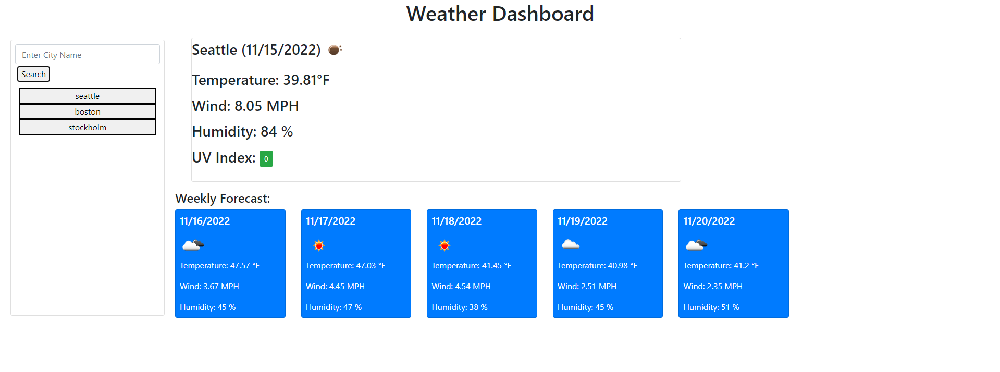

# Weather-Dashboard
[Link to deployed application](https://niklassolomon.github.io/Weather-Dashboard/)
## Goal:
The goal of this assignment was to build a webpage that displays weather data based on a city search from the user. The page should display the current weather in that city, as well as a five day forecast. Weather data should include the city name, the date, weather conditions, temperature, humidity, wind speed, and UV index. The UV index should be color coded to indicate normal, moderate, and severe levels. The city search should be saved and displayed on the page where the user can click on the city and retrieve city weather data.

## How:
Using the OpenWeather API, we are able to fetch weather data from different cities around the world and display the information using Javascript and HTML.

## Result:
The user is able to search for any city and have the current weather conditions, as well as a five day forecast rendered to the page in a clean and organized layout. The previously searched cities are displayed below the search bar and can be clicked to search for that city again.

[Link to Github Repository](https://github.com/NiklasSolomon/Weather-Dashboard)